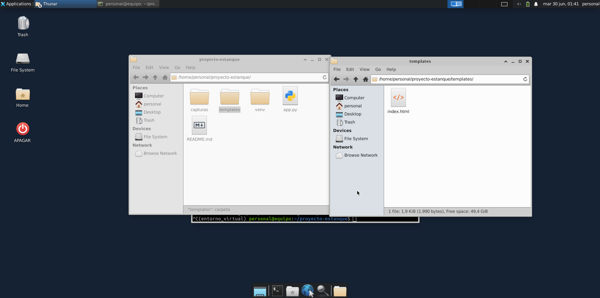
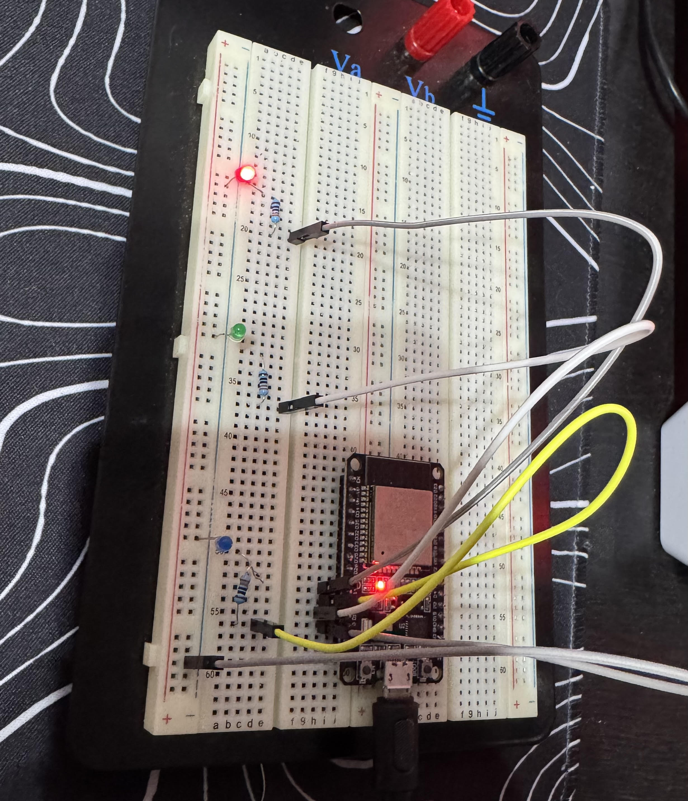
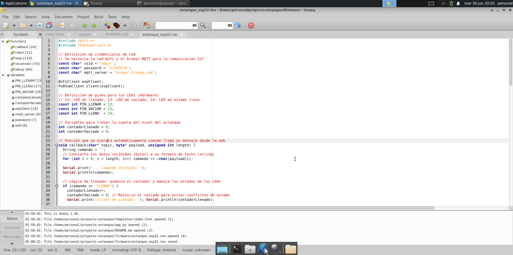
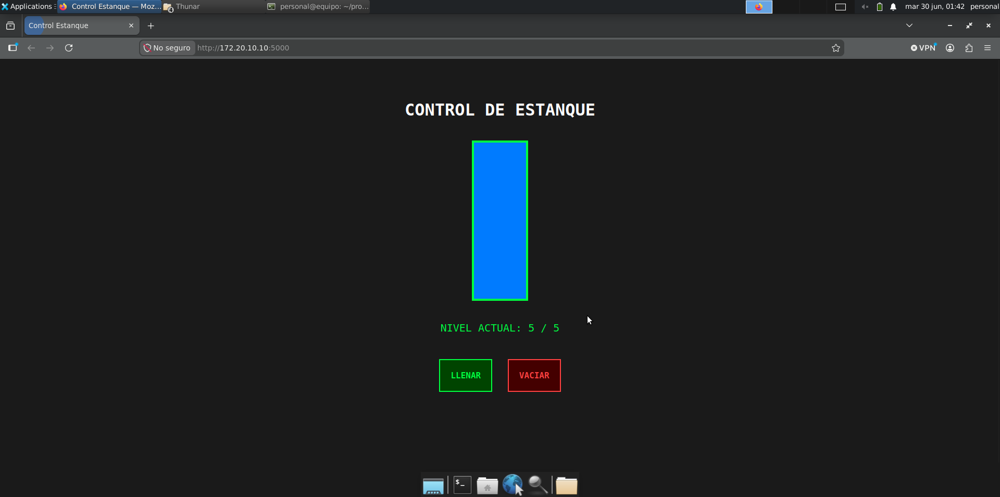
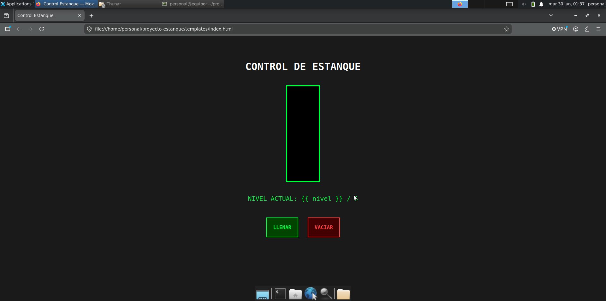
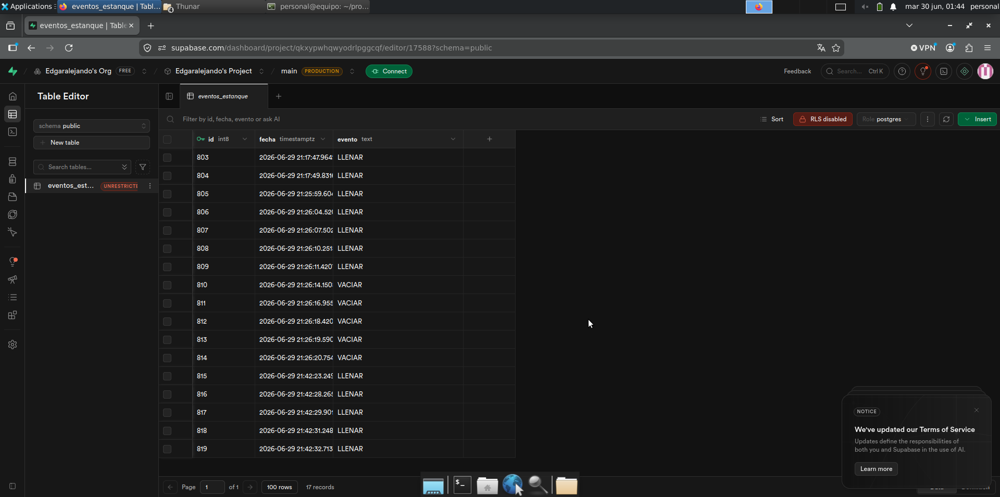

# Proyecto: Control Automatizado de Estanque (DCSH01)

**Autor:** Edgar Alejandro Díaz Pérez

## Descripción
Sistema IoT diseñado para el monitoreo y control de nivel de un estanque. Permite la visualización remota en una interfaz web, el control de actuadores físicos (llenado/vaciado) mediante un ESP32 y el registro histórico detallado de eventos en una base de datos en la nube (Supabase).

---

## Tecnologías Utilizadas
- **Hardware:** ESP32 (Control de actuadores y LEDs indicadores).
- **Comunicación:** Protocolo MQTT (Broker: HiveMQ).
- **Backend:** Python con Flask.
- **Base de Datos:** Supabase (PostgreSQL) con registros en UTC-4.
- **Frontend:** HTML5 y CSS3 (Sin uso de JavaScript).

---

## Evidencia Visual

### 1. Estructura y Hardware




### 2. Interfaz y Base de Datos




---

## Organización del Repositorio
```text
proyecto-estanque/
├── backend/            # Lógica del servidor (app.py y dependencias)
├── firmware/           # Código fuente para el ESP32 (estanque_esp32.ino)
├── templates/          # Interfaz web (index.html)
├── capturas/           # Evidencia visual del funcionamiento y estructura
└── README.md           # Documentación del proyecto
